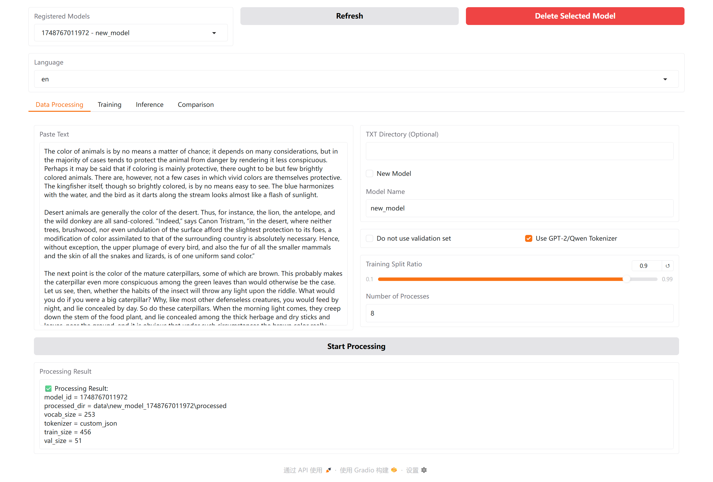
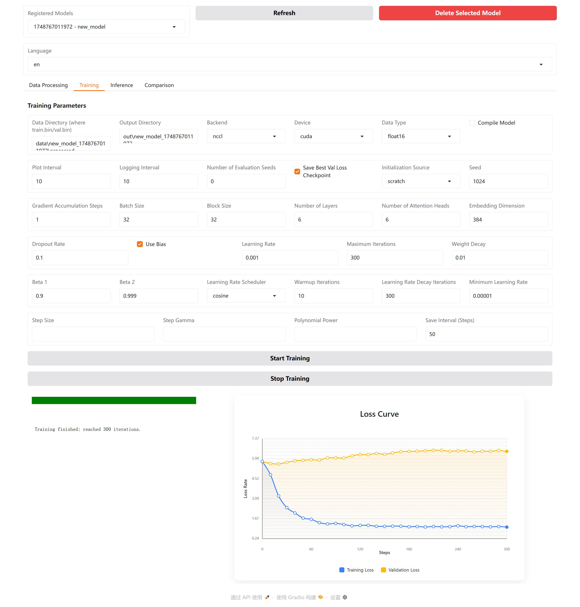
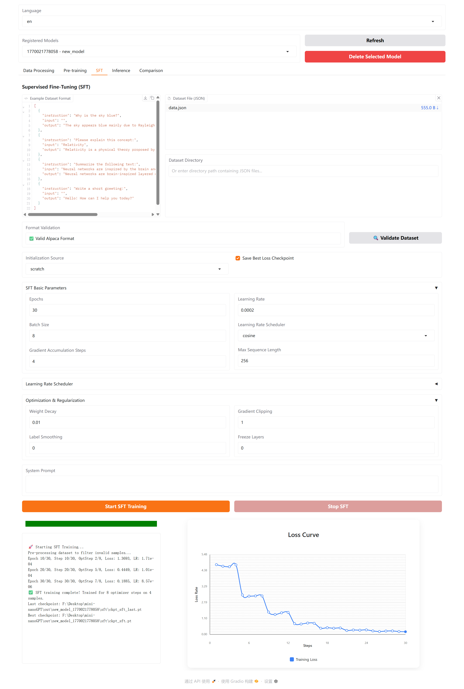
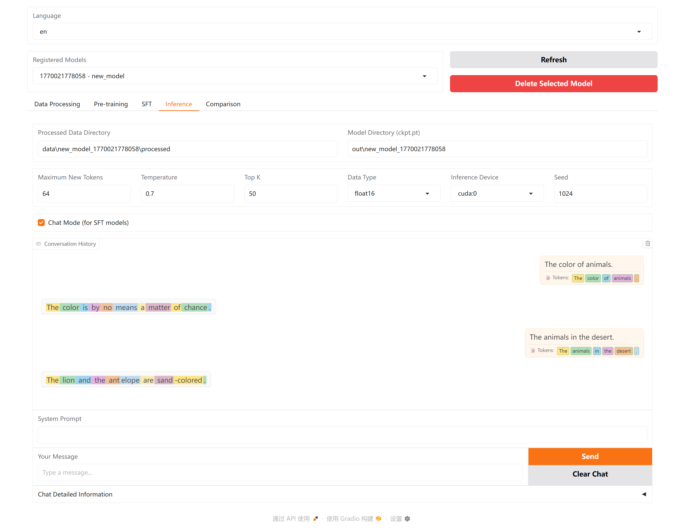
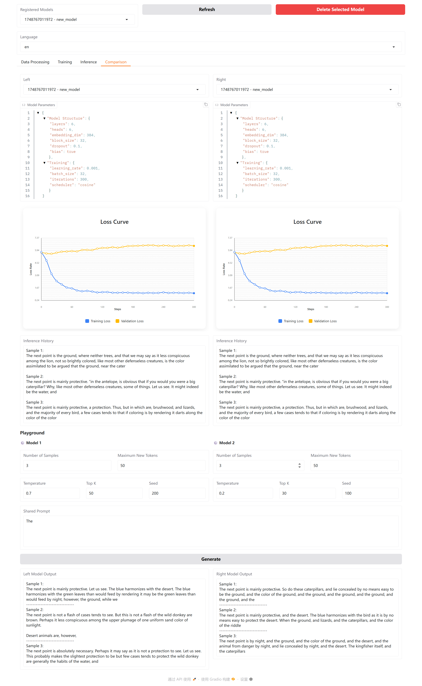

<div align="center">

<a href="https://github.com/ystemsrx/mini-nanoGPT">
  
</a>

# 🚀 Mini NanoGPT

### *Training a GPT can really be this simple!*

[](https://python.org)
[](https://pytorch.org)
[](https://gradio.app)
[](https://docker.com)
[](LICENSE)

<p>
  <a href="https://github.com/ystemsrx/mini-nanoGPT"><strong>English</strong></a>
  ·
  <a href="README.zh.md">简体中文</a>
</p>

<p>A visualized training platform upgraded from <a href="https://github.com/karpathy/nanoGPT">karpathy/nanoGPT</a>. <br/>Make GPT training fun and approachable!</p>

</div>

---

## 📖 What is this?

Mini-NanoGPT is a tool that helps you get started with training GPT models effortlessly. Whether you're:

| 🎓 Beginner | 👨‍🔬 Researcher | 🛠️ Developer |
|:---:|:---:|:---:|
| Just starting deep learning | Experimenting with LLM architectures | Building AI-powered applications |

Or simply curious about large language models and want to experience their magic — you can train a model through an intuitive graphical interface!

> [!NOTE]
> For the original version of Mini NanoGPT (no longer updated), please check out the [**old** branch](https://github.com/ystemsrx/mini-nanoGPT/tree/old).

---

## ✨ Key Features

<table>
<tr>
<td width="50%">

### 🎯 Easy to Use

- 📱 **Visual Interface** — Say goodbye to command line
- 🌍 **Bilingual UI** — Full English & Chinese support
- 🖱️ **One-click Operations** — Data processing, training, and generation

</td>
<td width="50%">

### ⚡ Powerful Features

- 🔤 **Flexible Tokenization** — Character-level, GPT-2, or Qwen tokenizers
- 🚄 **Efficient Training** — Multi-process acceleration & distributed training
- 📊 **Real-time Feedback** — Live training progress and loss curves

</td>
</tr>
<tr>
<td>

### 🧩 Model Management

- ⚙️ **Parameter Visualization** — Adjust all training parameters in UI
- 🗄️ **Model Database** — Easily manage and reuse training settings
- 📂 **Checkpoint Support** — Resume training from any saved state

</td>
<td>

### 🎓 SFT Training

- 💬 **Supervised Fine-Tuning** — Train conversational AI models
- 📋 **Alpaca Format** — Standard dataset format support
- 🤖 **Chat Inference** — Interactive conversation with fine-tuned models

</td>
</tr>
</table>

---

## 🚀 Getting Started

### Option 1: Docker Deployment (Recommended) 🐳

> The easiest way to get started!

```bash
# Clone the repository
git clone --depth 1 https://github.com/ystemsrx/mini-nanoGPT.git
cd mini-nanoGPT

# Start with Docker Compose (recommended)
docker-compose up --build

# Or build and run manually
docker build -t mini-nanogpt .
docker run --gpus all -p 7860:7860 -v $(pwd)/data:/app/data mini-nanogpt
```

This will automatically build the Docker image and run the container. The container will detect your system environment (CPU/GPU) automatically. The `data`, `models`, and `assets` directories in the current working directory will be mounted into the container.

🌐 Once started, visit **http://localhost:7860** to access the application.

For more details, please refer to [Docker Setup](docker/README.md).

---

### Option 2: Local Installation

```bash
# Clone the repository
git clone --depth 1 https://github.com/ystemsrx/mini-nanoGPT.git
cd mini-nanoGPT

# Install dependencies (Python 3.7+)
pip install -r requirements.txt

# Launch the app
python app.py
```

Open **http://localhost:7860** in your browser to see the training interface!

---

## 🎮 User Guide

### Step 1: Prepare Data

Navigate to the **"Data Processing"** page, paste your training text, and choose a tokenization method.

> [!TIP]
> - For better results, enable the tokenizer option — it will automatically build a vocabulary based on your text
> - If you don't want to use a validation set, check the "Skip validation set" option

Click **"Start Processing"** when you're done.

#### Supported Data Formats

You can provide training data in multiple ways:

| Method | Description |
|--------|-------------|
| **Direct Input** | Paste text directly into the text box |
| **Directory Input** | Specify a directory path containing your data files |

**Directory Mode** supports **recursive scanning** of all subdirectories and the following file formats:

- **`.txt`** — Plain text files (entire file as one document)
- **`.jsonl`** — JSON Lines format with `{"text": "..."}` structure

<details>
<summary>📝 <strong>JSONL Format Example</strong></summary>

```jsonl
{"text": "This is the first document content."}
{"text": "This is the second document content."}
{"text": "Each line is treated as a separate document with EOT token appended."}
```

</details>

> [!NOTE]
> When using directory input, files of different formats (.txt and .jsonl) can be mixed in the same directory structure. All files will be processed correctly.

<details>
<summary>📸 <strong>View Screenshot</strong></summary>
<br/>

</details>

---

### Step 2: Train the Model

Switch to the **"Training"** page and adjust the parameters as needed (or leave them as default for a quick try).

- **Loss Curves**: Blue = Training Loss, Orange = Validation Loss
- If only one curve appears, check the terminal for block size errors — try reducing it to 128

<details>
<summary>📸 <strong>View Screenshot</strong></summary>
<br/>

</details>

> [!NOTE]
> **Evaluation Mode Only?**  
> Set the `Number of Evaluation Seeds` to any value > 0 to activate evaluation-only mode. You'll see how the model performs with different random seeds.

---

### Step 3: Generate Text

Go to the **"Inference"** page, enter a prompt, and click **"Generate"** to see what the model comes up with!

<details>
<summary>📸 <strong>View Screenshot</strong></summary>
<br/>

</details>

---

### Step 4: SFT Training (Fine-Tuning) 🆕

The **Supervised Fine-Tuning (SFT)** feature allows you to fine-tune pre-trained models for conversational AI tasks.

#### How to Use SFT:

1. Navigate to the **"SFT"** page
2. Select a pre-trained base model from your model database
3. Import your dataset in **Alpaca format** (JSON file or directory)
4. Configure training parameters (learning rate, epochs, etc.)
5. Click **"Start Training"** to begin fine-tuning

<details>
<summary>📸 <strong>View SFT Training Screenshot</strong></summary>
<br/>

</details>

#### Alpaca Dataset Format:

```json
[
  {
    "instruction": "What is the capital of France?",
    "input": "",
    "output": "The capital of France is Paris."
  },
  {
    "instruction": "Translate the following to Spanish:",
    "input": "Hello, how are you?",
    "output": "Hola, ¿cómo estás?"
  }
]
```

#### Chat with SFT Models:

After SFT training, go to the **"Inference"** page to have interactive conversations with your fine-tuned model!

<details>
<summary>📸 <strong>View SFT Inference Screenshot</strong></summary>
<br/>

</details>

---

### Step 5: Model Comparison

Navigate to the **"Comparison"** page to compare two models side by side:

- Select two models (they can even be the same model with different settings)
- Their configurations will be displayed automatically
- Input the same prompt to see how both models generate text
- Compare outputs with different inference settings (temperature, top_k, etc.)

<details>
<summary>📸 <strong>View Screenshot</strong></summary>
<br/>

</details>

---

## 📁 Project Structure

```
mini-nanoGPT/
├── 📄 app.py                 # Application entry point
├── 📂 src/                   # Source code modules
│   ├── 📂 ui/                # Gradio UI components
│   │   ├── app.py            # Main UI layout
│   │   ├── bindings/         # UI event bindings
│   │   └── callbacks/        # UI callback functions
│   ├── config.py             # Configuration management
│   ├── data_process.py       # Data preprocessing
│   ├── train.py              # Pre-training logic
│   ├── sft.py                # SFT training module
│   ├── infer.py              # Text generation
│   ├── db_manager.py         # Model database management
│   └── gpt_model.py          # GPT model architecture
├── 📂 data/                  # Training data storage
├── 📂 out/                   # Model checkpoints
├── 📂 assets/                # Tokenizer files and resources
└── 📂 docker/                # Docker configuration files
```

---

## ❓ FAQ

<details>
<summary><strong>🐢 Running too slowly?</strong></summary>

- 💡 Reduce batch size or model size
- 💡 Use a GPU to greatly improve speed
- 💡 Increase the evaluation interval

</details>

<details>
<summary><strong>📝 Generated text isn't good?</strong></summary>

- 💡 Try increasing the training data
- 💡 Tune the model hyperparameters
- 💡 Adjust the temperature during generation

</details>

<details>
<summary><strong>🔄 Want to resume previous training?</strong></summary>

- 💡 On the "Training" page, select "resume" under Initialization
- 💡 Point to the previous output directory

</details>

<details>
<summary><strong>💬 How to use SFT?</strong></summary>

- 💡 First train a base model using pre-training
- 💡 Prepare your dataset in Alpaca JSON format
- 💡 Go to the SFT page and select your base model
- 💡 Upload your dataset and start fine-tuning

</details>

---

## 🤝 Contributing

Suggestions and improvements are welcome! You can:

- 🐛 Submit an [Issue](https://github.com/ystemsrx/mini-nanoGPT/issues)
- 🔧 Open a [Pull Request](https://github.com/ystemsrx/mini-nanoGPT/pulls)
- 💬 Share your experience using the tool

---

## 📝 License

This project is open-sourced under the [MIT License](LICENSE).

---

<div align="center">

### 🎉 Start your GPT journey now!

<a href="https://github.com/ystemsrx/mini-nanoGPT">
  
</a>

</div>
