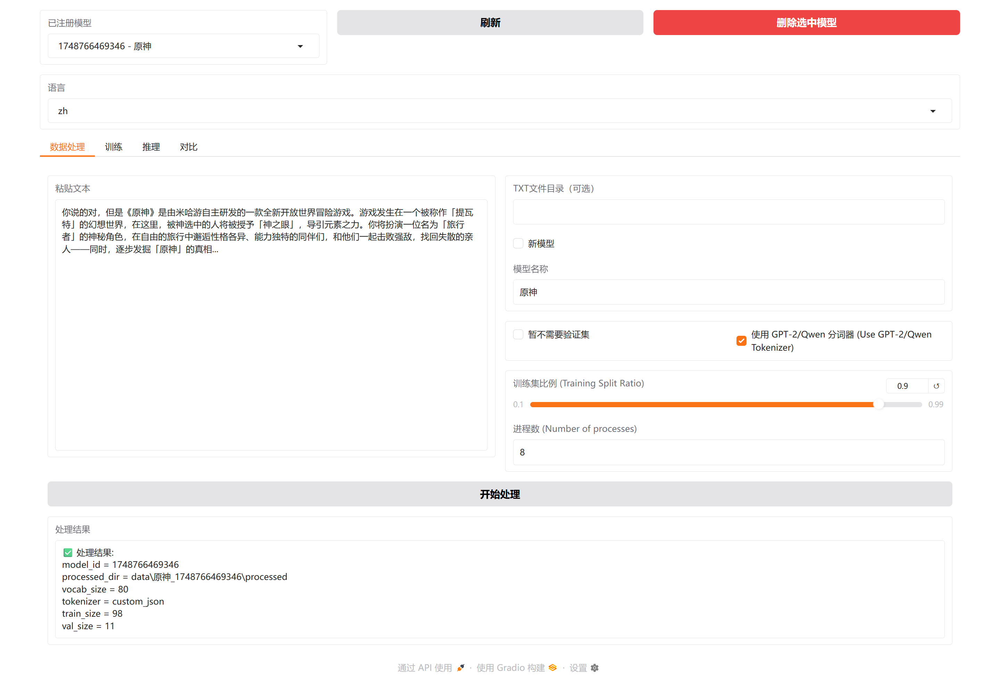
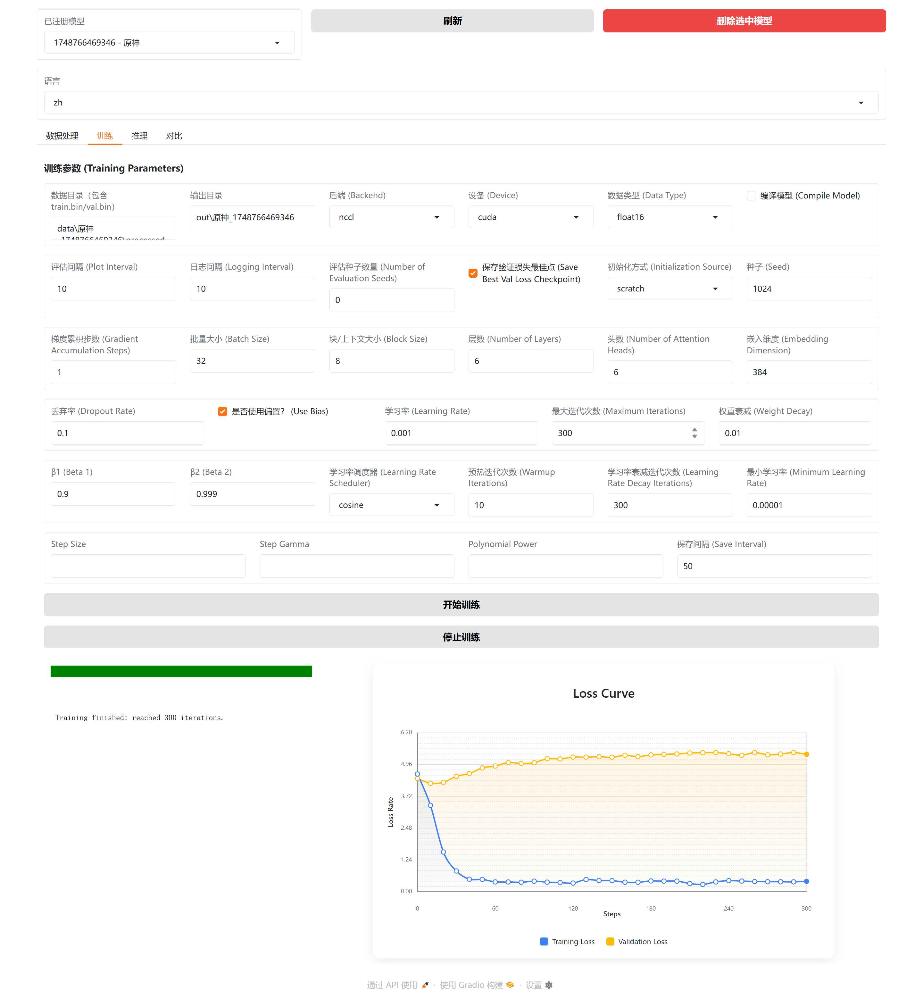
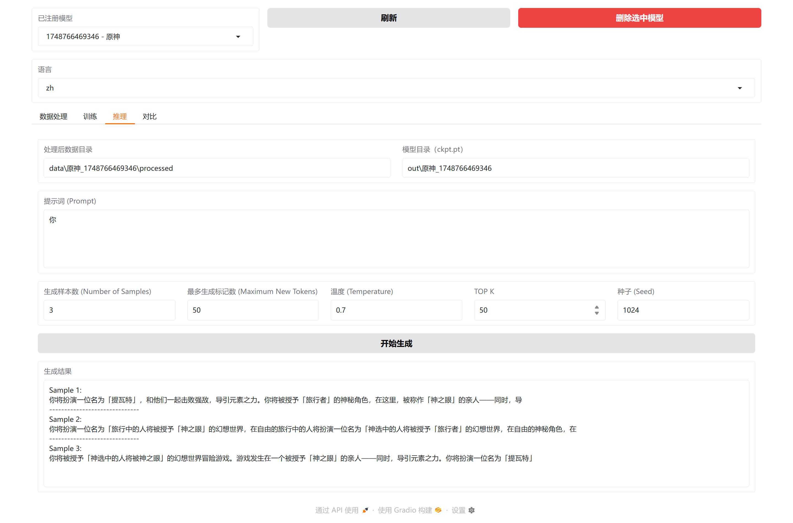
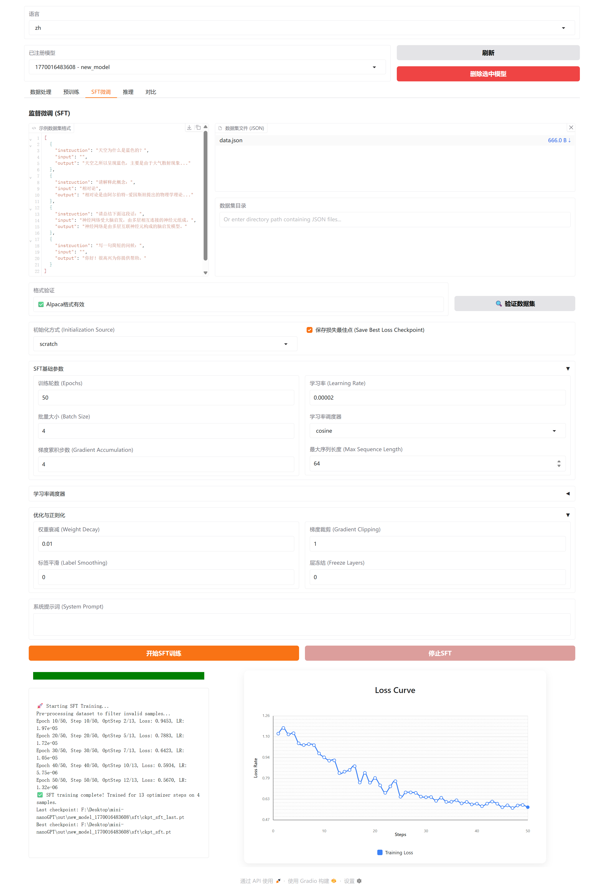
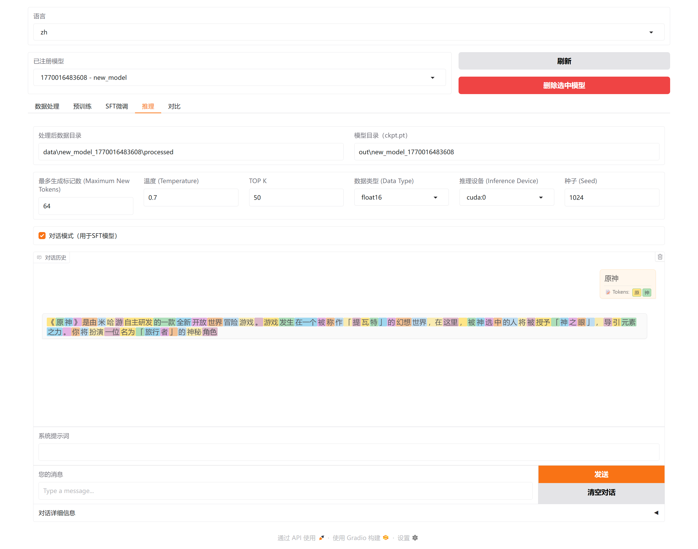

<div align="center">

<a href="https://github.com/ystemsrx/mini-nanoGPT">
  
</a>

# 🚀 Mini NanoGPT

### *训练一个 GPT 原来可以这么简单！*

[](https://python.org)
[](https://pytorch.org)
[](https://gradio.app)
[](https://docker.com)
[](LICENSE)

<p>
  <a href="https://github.com/ystemsrx/mini-nanoGPT">English</a>
  ·
  <a href="README.zh.md"><strong>简体中文</strong></a>
</p>

<p>基于 <a href="https://github.com/karpathy/nanoGPT">karpathy/nanoGPT</a> 升级的可视化训练平台<br/>让 GPT 模型训练变得简单有趣！</p>

</div>

---

## 📖 这是什么？

Mini-NanoGPT 是一个帮助你轻松入门 GPT 模型的工具。无论你是：

| 🎓 初学者 | 👨‍🔬 研究人员 | 🛠️ 开发者 |
|:---:|:---:|:---:|
| 刚开始学习深度学习 | 实验 LLM 架构 | 构建 AI 驱动的应用 |

亦或只是对大模型感兴趣，想体验一下它的魅力 — 都能通过简单的图形界面完成模型训练！

> [!NOTE]
> 初始版本的 Mini NanoGPT（不再更新）请查看 [**old** 分支](https://github.com/ystemsrx/mini-nanoGPT/tree/old)

---

## ✨ 主要特点

<table>
<tr>
<td width="50%">

### 🎯 简单易用

- 📱 **可视化界面** — 告别命令行
- 🌍 **中英双语** — 完整的中英文界面支持
- 🖱️ **一键操作** — 数据处理、训练、生成一键完成

</td>
<td width="50%">

### ⚡ 功能强大

- 🔤 **灵活的分词** — 字符级、GPT-2 或 Qwen 分词器
- 🚄 **高效训练** — 多进程加速和分布式训练
- 📊 **实时反馈** — 实时显示训练进度和损失曲线

</td>
</tr>
<tr>
<td>

### 🧩 模型管理

- ⚙️ **参数可视化** — 在界面上直接调整所有参数
- 🗄️ **数据库管理** — 轻松管理和复用训练设置
- 📂 **断点续训** — 从任意保存点恢复训练

</td>
<td>

### 🎓 SFT 训练

- 💬 **监督微调** — 训练对话式 AI 模型
- 📋 **Alpaca 格式** — 标准数据集格式支持
- 🤖 **对话推理** — 与微调模型进行交互式对话

</td>
</tr>
</table>

---

## 🚀 快速开始

### 方式一：Docker 部署（推荐）🐳

> 最简单的启动方式！

```bash
# 克隆仓库
git clone --depth 1 https://github.com/ystemsrx/mini-nanoGPT.git
cd mini-nanoGPT

# 使用 Docker Compose 启动（推荐）
docker-compose up --build

# 或手动构建运行
docker build -t mini-nanogpt .
docker run --gpus all -p 7860:7860 -v $(pwd)/data:/app/data mini-nanogpt
```

这将会自动构建 Docker 镜像并运行容器，容器会自动检测你的系统环境（CPU/GPU）。同时，会将当前目录下的 `data`、`models` 和 `assets` 目录挂载到容器中。

🌐 启动后访问 **http://localhost:7860** 即可。

更多信息请查看 [Docker 部署](docker/README.zh.md)。

---

### 方式二：本地安装

```bash
# 克隆仓库
git clone --depth 1 https://github.com/ystemsrx/mini-nanoGPT.git
cd mini-nanoGPT

# 安装依赖（Python 3.7+）
pip install -r requirements.txt

# 启动项目
python app.py
```

打开浏览器访问 **http://localhost:7860**，就能看到训练界面了！

---

## 🎮 使用指南

### 第一步：准备数据

打开**数据处理**页面，选择或粘贴你的训练文本并选择分词方式。

> [!TIP]
> - 若要追求更好的效果，可以勾选使用分词器，会自动根据你的文本内容构建词汇表
> - 如果你暂时不想使用验证集，可以勾选「暂不使用验证集」

完成后点击**开始处理**。

#### 支持的数据格式

你可以通过多种方式提供训练数据：

| 方式 | 说明 |
|------|------|
| **直接输入** | 在文本框中直接粘贴文本 |
| **目录输入** | 指定包含数据文件的目录路径 |

**目录模式**支持**递归扫描**所有子目录，并支持以下文件格式：

- **`.txt`** — 纯文本文件（整个文件作为一个文档）
- **`.jsonl`** — JSON Lines 格式，每行为 `{"text": "..."}` 结构

<details>
<summary>📝 <strong>JSONL 格式示例</strong></summary>

```jsonl
{"text": "这是第一个文档的内容。"}
{"text": "这是第二个文档的内容。"}
{"text": "每一行都会被视为独立文档，末尾自动添加 EOT 标记。"}
```

</details>

> [!NOTE]
> 使用目录输入时，同一目录结构下可以混合存放不同格式的文件（.txt 和 .jsonl），所有文件都会被正确处理。

<details>
<summary>📸 <strong>查看截图</strong></summary>
<br/>

</details>

---

### 第二步：训练模型

切换到**训练**页面，根据需要调整参数（如果只是想体验，可以保持默认值）。

- **损失曲线**：蓝色 = 训练集损失，橙色 = 验证集损失
- 如果只显示了一条曲线，请检查终端输出是否有 block size 错误 — 尝试将其调小到 128

<details>
<summary>📸 <strong>查看截图</strong></summary>
<br/>

</details>

> [!NOTE]
> **仅评估模式？**  
> 将 `评估种子数量 (Number of Evaluation Seeds)` 调为大于 0 的任意值，将开启仅评估模式。你能看到模型在使用不同种子上的损失。

---

### 第三步：生成文本

进入**推理**页面，输入一段开头文字，点击**生成**，看看模型会写出什么！

<details>
<summary>📸 <strong>查看截图</strong></summary>
<br/>

</details>

---

### 第四步：SFT 训练（微调）

**监督微调（SFT）** 功能允许你对预训练模型进行微调，用于对话式 AI 任务。

#### 如何使用 SFT：

1. 进入**SFT**页面
2. 从模型数据库中选择一个预训练的基座模型
3. 导入你的 **Alpaca 格式** 数据集（JSON 文件或目录）
4. 配置训练参数（学习率、轮数等）
5. 点击**开始训练**开始微调

<details>
<summary>📸 <strong>查看 SFT 训练截图</strong></summary>
<br/>

</details>

#### Alpaca 数据集格式：

```json
[
  {
    "instruction": "法国的首都是哪里？",
    "input": "",
    "output": "法国的首都是巴黎。"
  },
  {
    "instruction": "将以下内容翻译成英语：",
    "input": "你好，最近怎么样？",
    "output": "Hello, how have you been?"
  }
]
```

#### 与 SFT 模型对话：

SFT 训练完成后，进入**推理**页面，即可与你微调后的模型进行交互式对话！

<details>
<summary>📸 <strong>查看 SFT 推理截图</strong></summary>
<br/>

</details>

---

### 第五步：模型对比

进入**对比**页面，可以并排比较两个模型：

- 选择你想对比的模型（也可以是同一个模型使用不同设置）
- 配置将自动展示
- 输入同一个提示词，看看不同模型的表现
- 使用不同的推理配置（如温度、top_k 等）进行对比

<details>
<summary>📸 <strong>查看截图</strong></summary>
<br/>

</details>

---

## 📁 项目结构

```
mini-nanoGPT/
├── 📄 app.py                 # 应用入口
├── 📂 src/                   # 源代码模块
│   ├── 📂 ui/                # Gradio UI 组件
│   │   ├── app.py            # 主界面布局
│   │   ├── bindings/         # UI 事件绑定
│   │   └── callbacks/        # UI 回调函数
│   ├── config.py             # 配置管理
│   ├── data_process.py       # 数据预处理
│   ├── train.py              # 预训练逻辑
│   ├── sft.py                # SFT 训练模块
│   ├── infer.py              # 文本生成
│   ├── db_manager.py         # 模型数据库管理
│   └── gpt_model.py          # GPT 模型架构
├── 📂 data/                  # 训练数据存储
├── 📂 out/                   # 模型权重
├── 📂 assets/                # 分词器文件和资源
└── 📂 docker/                # Docker 配置文件
```

---

## ❓ 常见问题

<details>
<summary><strong>🐢 运行得太慢怎么办？</strong></summary>

- 💡 减小 batch_size 或模型大小
- 💡 使用 GPU 会大大加快速度
- 💡 将评估间隔调大

</details>

<details>
<summary><strong>📝 生成的文本不够好？</strong></summary>

- 💡 试试增加训练数据量
- 💡 适当调整模型参数
- 💡 改变生成时的温度参数

</details>

<details>
<summary><strong>🔄 想继续之前的训练？</strong></summary>

- 💡 在「训练页面」中的「初始化方式」中选择 "resume"
- 💡 指定之前的输出目录即可

</details>

<details>
<summary><strong>💬 如何使用 SFT？</strong></summary>

- 💡 首先使用预训练方式训练一个基座模型
- 💡 准备好 Alpaca JSON 格式的数据集
- 💡 进入 SFT 页面，选择你的基座模型
- 💡 上传数据集并开始微调

</details>

---

## 🤝 参与贡献

欢迎提出建议和改进！可以通过以下方式参与：

- 🐛 提交 [Issue](https://github.com/ystemsrx/mini-nanoGPT/issues)
- 🔧 提交 [Pull Request](https://github.com/ystemsrx/mini-nanoGPT/pulls)
- 💬 分享你的使用经验

---

## 📝 许可证

本项目采用 [MIT License](LICENSE) 协议开源。

---

<div align="center">

### 🎉 开始你的 GPT 之旅吧！

<a href="https://github.com/ystemsrx/mini-nanoGPT">
  
</a>

</div>
